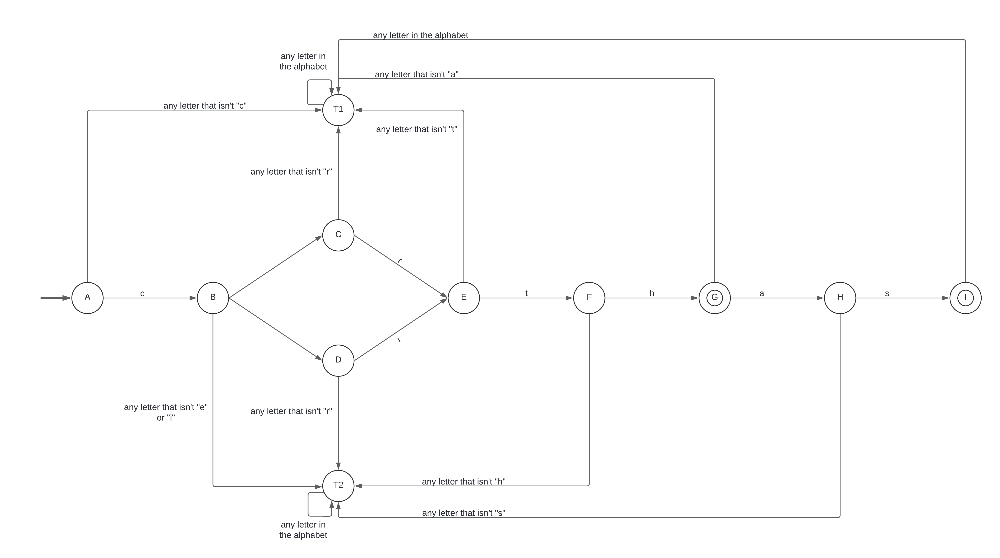
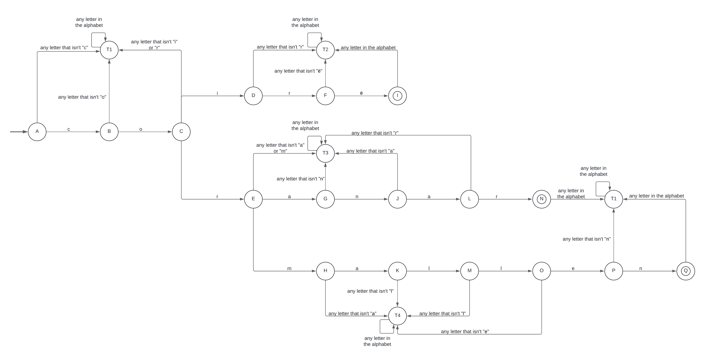

## Description

I choose a subset of the Elvish languages created by J.R.R. Tolkien. focusing on the next words:
- Certhas
- Cirth
- Coirë
- Coranar
- Cormallen

Although these only represent a small fraction of the Elvish lexicon, the process needed to solve other similar problems can be reasoned out from doing it in this example, with the most notable difference being the increasing complexity of broader scenarios.

I constructed two Deterministic Finite Automata (DFA): one for the first two words and the other one for the rest. The alphabet used in the lexicon is {a, c, e, h, i, l, m, n, o, r, s, t, ë}


## Model of the Solution

**Automaton 1**: Represents the words "Certhas" and "Cirth".



**Automaton 2**: Represents the words "Coirë," "Coranar," and "Cormallen".



The above automaton are equivalent to the following regular expressions:
- **DFA 1 → RE 1**: `^C(erthas|irth)$`
- **DFA 2 → RE 2**: `^C(oirë|oranar|ormallen)$`

Taking both into account, the complete regular expression can be formed: `^C(erthas|irth|oirë|oranar|ormallen)$`.


## Implementation

The implementation involves utilizing the derived regular expressions for the lexical analysis, as demonstrated in the `regex.py` file. To use the file, the user needs to introduce the number of words they wish to test, followed by the words themselves. The program then assesses whether each word is part of the defined Elvish subset, printing a "yes" for affirmative matches and "no" otherwise.

### Examples of Inputs and Outputs:
- `certhas` → yes
- `arda` → no
- `Coirë` → yes
- `Dae` → no


## Tests

The `tests.py` file contains all of the test cases.


## Analysis

Although I wasn’t able to directly analyze the implementation that Python uses for handling regular expressions, even after reading the `re` module documentation and its source code, I found out thanks to an article made by Cox (2007), that Python uses a backtracking method with a time complexity of _O(mn)_ for the average cases where _m_ is the length of the regex pattern and _n_ is the length of the string, and _O(2^n)_ for the worst cases, where _n_ is the number of elements involved in the backtracking.

_Note:
In regular expressions, backtracking happens when the engine tries to match a pattern to a string but reaches a point where it can’t continue the current path it’s taking, so it “backtracks” to the last place where it had the possibility of making a different choice. It’s useful to visualize it using the above automaton._

Now, in the particular case of my regular expression, the inclusion of starting and ending anchors significantly optimizes this complexity. This is thanks to the lack of abstraction that makes the regex quickly discard the input strings that don't match the required patterns, thus no backtracking is required and both the worst and average cases complexities end up being nearly identical and closer to to **linear _O(n)_** or **polynomial _O(mn)_** time complexities.

### Worst Case:

A string that almost matches one of the options but fails at the last character, forcing the engine to check the entire length of the input.

### Average Case:

A random distribution of input strings, where many inputs are going to be quickly rejected.

### Hand Analysis Time Complexities

#### Linear Time Complexity O(n)

```py
count = 0
for i in list:
  count++
print(count)
```


#### Polynomial Time Complexity O(mn)

```py
commonElements = 0
list1 = [elements]
list2 = [elements]

for element1 in list1:
  for element2 in list2:
    if element1 == element2:
      commonElements++
print(commonElements)
```

## References

- Cox, R. (2007, January). "Regular expression matching can be simple and fast." [https://swtch.com/~rsc/regexp/regexp1.html](https://swtch.com/~rsc/regexp/regexp1.html).
- "Python RegEx." (n.d.). [https://www.w3schools.com/python/python_regex.asp](https://www.w3schools.com/python/python_regex.asp).
- "re — Regular expression operations." (n.d.). [https://docs.python.org/3/library/re.html)](https://docs.python.org/3/library/re.html).
